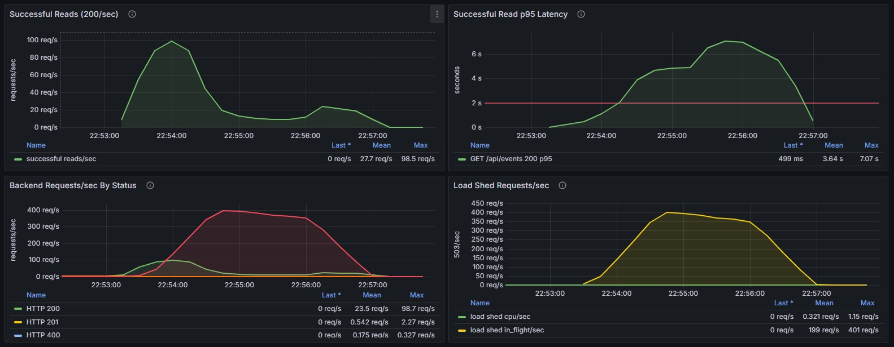
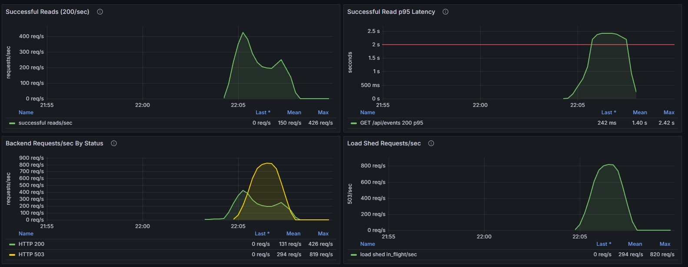
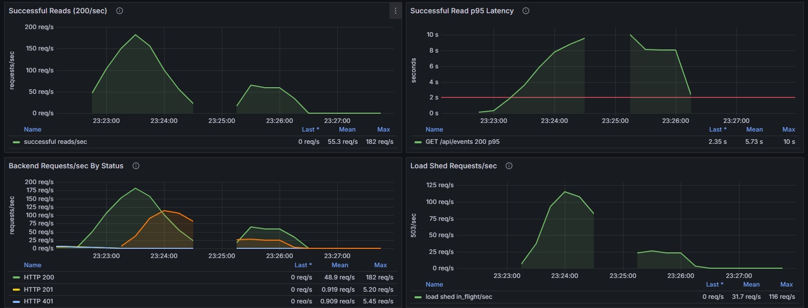
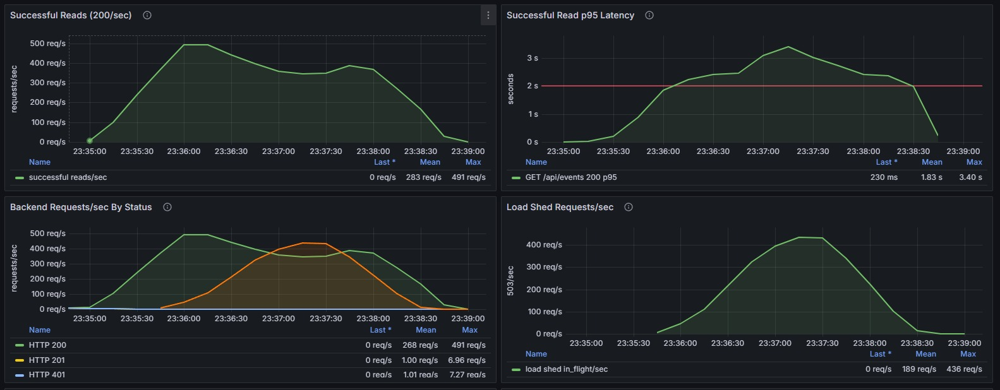
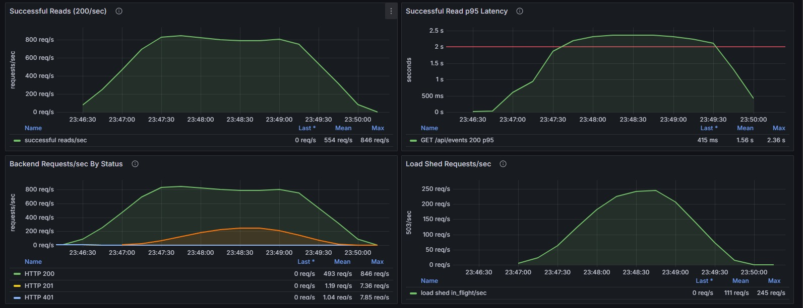

# Gamba
A sport event application developed for a scalable engineering project 

## Overview

Gamba is a web-only sports venue booking application. Players can browse and join open sports events in European cities. Organizers can create events at specific venues, times, and skill levels. The app is also the subject of a scalability engineering assignment, so the architecture is designed to demonstrate stateless/stateful separation, horizontal scaling, overload mitigation, caching, and observability.

---

## Assignment Requirements Mapping

| # | Requirement | Implementation |
|---|---|---|
| 1 | Stateless + stateful separation | FastAPI nodes are fully stateless; all state lives in PostgreSQL (persistent) and Redis (cache) |
| 2 | Scale 1 → 3 → 5 nodes | `backend_node_count` Terraform variable; Nginx round-robins across nodes |
| 3 | Overload mitigation (no library) | Hand-rolled **token bucket rate limiter** in `middleware/rate_limiter.py` — no library used |
| 4a | Additional strategy 1 | **Redis read-through cache** on `GET /events`, 30s TTL, invalidated on writes |
| 4b | Additional strategy 2 | **Prometheus observability** — `/metrics` endpoint with request counters, latency histograms, cache hit/miss counters |
| Bonus | Vertical scaling evaluation | Re-run load tests on the default `e2-micro` vs `e2-standard-2` for 1/3/5 node configs |

---

## Architecture

```
[React Frontend — static files served by Nginx LB]
                    |
         [Infra VM: Nginx + PostgreSQL + Redis]   ← public IP, port 80
          /          |          \
    [FastAPI]    [FastAPI]    [FastAPI]   ← 1 / 3 / 5 nodes, port 8000 (internal)
          \          |          /
           [PostgreSQL]       [Redis]     ← both on the infra VM, internal only
```

**Stateless components:** FastAPI backend nodes — no local state between requests, safe to add/remove at any time.  
**Stateful components:** PostgreSQL (source of truth), Redis (shared cache).

---

## Tech Stack

| Layer | Choice |
|---|---|
| Frontend | React + Vite (minimal UI, served as static files by Nginx) |
| Backend | Python FastAPI |
| Database | PostgreSQL 16 (single node, not scaled) |
| Cache | Redis 7 (single node) |
| Load Balancer | Nginx (manual round-robin) |
| Infrastructure | Terraform on GCP Compute Engine |
| Load Testing | K6 |

---

## Project Structure

```
gamba/
├── frontend/
│   ├── src/
│   │   ├── main.jsx
│   │   ├── App.jsx
│   │   ├── api.js                    # Axios instance with JWT interceptor
│   │   └── pages/
│   │       ├── Login.jsx             # Register / login, role selector
│   │       ├── OrganizerView.jsx     # Create event form
│   │       └── PlayerView.jsx        # Browse + join events
│   ├── index.html
│   ├── .env.example
│   └── package.json
├── backend/
│   ├── main.py                       # FastAPI app, CORS, middleware, routers
│   ├── routers/
│   │   ├── auth.py                   # POST /api/auth/register, POST /api/auth/login
│   │   └── events.py                 # GET/POST /api/events, POST /api/events/{id}/join
│   ├── middleware/
│   │   ├── rate_limiter.py           # Hand-rolled token bucket per IP
│   │   └── load_shedder.py           # In-flight, CPU, and latency-based load shedding
│   ├── auth_utils.py                 # bcrypt hashing, JWT encode/decode
│   ├── cache.py                      # Redis get/set/delete helpers
│   ├── metrics.py                    # Prometheus counters, gauges + histograms
│   ├── database.py                   # SQLAlchemy engine + session, DB query/pool metrics
│   ├── models.py                     # SQLAlchemy ORM models
│   ├── schemas.py                    # Pydantic request/response schemas
│   ├── .env.example
│   └── requirements.txt
├── infrastructure/
│   ├── main.tf                       # VMs, VPC, firewall rules
│   ├── variables.tf                  # backend_node_count, machine_type, region, images, jwt_secret_key
│   ├── locals.tf                     # Derived names and image URLs
│   ├── nginx.conf.tpl                # Nginx upstream template (IPs injected by Terraform)
│   ├── startup-infra.sh.tpl          # Infra VM startup script (Nginx, PostgreSQL, Redis, observability)
│   ├── startup-backend.sh.tpl        # Backend VM startup script (pulls image, writes .env)
│   └── outputs.tf                    # LB public IP, backend IPs, observability URLs
├── scripts/
│   ├── build_images.sh               # Build and push Docker images to Artifact Registry
│   ├── deploy.sh                     # Provision registry, build images, deploy the GCP cluster
│   ├── bootstrap.sh                  # Legacy VM bootstrap script from the pre-container flow
│   ├── loadtest_stack.sh             # Bring up the local 1/3/5-node load-test stack
│   ├── load_test.js                  # K6 load test script (read-heavy)
│   └── load_test_db_heavy.js         # K6 load test script (write/DB-heavy)
├── observability/                    # Prometheus configs, Grafana provisioning, loadtest Nginx confs,
│                                     # postgres-exporter queries
├── docker-compose.loadtest.yml       # Local 5-backend stack with Nginx LB and postgres-exporter
└── README.md
```

---

## Data Model

### `users`
```
id           SERIAL PRIMARY KEY
username     VARCHAR(100) UNIQUE NOT NULL
password     VARCHAR(255) NOT NULL          -- bcrypt hash
role         VARCHAR(20) NOT NULL           -- 'player' | 'organizer'
created_at   TIMESTAMP DEFAULT NOW()
```

### `events`
```
id           SERIAL PRIMARY KEY
city         VARCHAR(100) NOT NULL
address      TEXT NOT NULL
sport        VARCHAR(50) NOT NULL
level        INTEGER NOT NULL               -- 1 to 5
event_time   TIMESTAMP NOT NULL
capacity     INTEGER NOT NULL
joined_count INTEGER NOT NULL DEFAULT 0     -- denormalized counter, kept in sync with event_participations
created_at   TIMESTAMP DEFAULT NOW()
```

### `event_participations`
```
user_id      INTEGER NOT NULL REFERENCES users(id)
event_id     INTEGER NOT NULL REFERENCES events(id)
joined_at    TIMESTAMP DEFAULT NOW()
PRIMARY KEY (user_id, event_id)             -- composite PK; a user can join an event at most once
```

---

## API Endpoints

```
GET  /health
     → {status: "ok", node_id: "<hostname>"}   -- hostname changes per node (proves round-robin)

GET  /metrics
     → Prometheus text format

POST /api/auth/register
     body: {username, password, role}
     → 201 {username, role}

POST /api/auth/login
     body: {username, password}
     → 200 {access_token, role}

GET  /api/events?city=X&sport=Y&day=YYYY-MM-DD
     auth: JWT required (player or organizer)
     → cached in Redis (key = "events:{city}:{sport}:{day}", TTL 30s)
     → list of event objects

POST /api/events
     auth: organizer JWT required
     body: {city, address, sport, level, event_time, capacity}
     → 201 event object
     → invalidates all matching event-list keys (every city/sport/day
       combination for the event, including the "all" catch-all variants)

POST /api/events/{id}/join
     auth: player JWT required
     → 200 {joined_count, capacity}
     → 409 "Already joined this event" if the player already joined
     → 409 "Event is full" if joined_count >= capacity
     → records a row in event_participations and invalidates the matching
       event-list keys (including the "all" catch-all variants)
```

---

## Scalability Strategies

### Req 3 — Token Bucket Rate Limiter (hand-rolled, no library)

`middleware/rate_limiter.py` — Starlette middleware:
- **Algorithm:** Token bucket, one bucket per IP address, stored in-memory dict
- **Bucket size:** 120 tokens
- **Refill rate:** 5 tokens/second
- **On empty bucket:** return `429 Too Many Requests`
- Increments `gamba_rate_limited_total` Prometheus counter on each 429

### Load Shedding

`middleware/load_shedder.py` rejects requests with `503 Service Unavailable` when the backend is overloaded:
- **In-flight pressure:** accepts all requests below `IN_FLIGHT_SOFT_LIMIT`, sheds gradually between soft and hard limits, and sheds all requests at `IN_FLIGHT_HARD_LIMIT`
- **CPU pressure:** tracks backend process CPU EWMA and probabilistically rejects based on how far it is above `MAX_PROCESS_CPU_PERCENT`
- **Latency pressure:** tracks an EWMA latency estimate and probabilistically rejects based on how far it is above `MAX_AVG_LATENCY_MS`
- **Shedding cap:** `MAX_SHED_PROBABILITY` can keep a small trickle of requests admitted even under severe pressure
- **Bypass paths:** `/health` and `/metrics` are always allowed
- **Metrics:** increments `gamba_load_shed_total{reason="in_flight"}`, `gamba_load_shed_total{reason="cpu"}`, or `gamba_load_shed_total{reason="latency"}`

Rate limiting and load shedding intentionally use different status codes: `429` means one client/IP is sending too much traffic, while `503` means the backend node is protecting itself from global overload.

**Known limitation (documented):** Each backend node maintains its own in-memory bucket. Per node, a client gets a 120-request burst and 5 req/s sustained — so with N nodes behind round-robin that multiplies to 120 × N burst and 5 × N req/s sustained before hitting any limit. A production system would use a shared Redis counter. This is an intentional known trade-off, documented for the presentation.

### Req 4a — Redis Read-Through Cache

`cache.py`:
- Cache key: `events:{city}:{sport}:{day}` — omitted filters use `all` (e.g. `events:Berlin:all:all`)
- TTL: 30 seconds
- Read: check Redis → hit: return cached JSON; miss: query PostgreSQL, store in Redis
- Write (`POST /events`, `POST /events/{id}/join`): delete every key combination that could contain the event — all 8 city/sport/day permutations including the `all` catch-alls
- Prometheus counters: `gamba_cache_hits_total`, `gamba_cache_misses_total`

### Req 4b — Prometheus Observability

`metrics.py`:
```
gamba_requests_total{method, endpoint, status}
gamba_request_duration_seconds{endpoint, status}
gamba_cache_hits_total
gamba_cache_misses_total
gamba_rate_limited_total
gamba_load_shed_total{reason}
gamba_in_flight_requests
gamba_latency_ewma_ms
gamba_cpu_ewma_percent
gamba_db_query_duration_seconds{operation}
gamba_db_queries_total{operation, outcome}
gamba_db_pool_checked_out
```
The `gamba_db_*` metrics are emitted by SQLAlchemy event hooks in `database.py` (per-query duration and success/error counts by SQL operation, plus connections currently checked out of the pool). Exposed at `GET /metrics` in Prometheus text format. No auth required (internal network only in production).

---

## Observability

The backend exposes Prometheus metrics at:

```bash
curl http://localhost:8000/metrics
```

For local load testing, `docker-compose.loadtest.yml` starts Prometheus and Grafana in addition to the application stack:

| Service | Local URL | Purpose |
|---|---|---|
| Backend metrics | `http://localhost:8000/metrics` | Raw Prometheus text output from FastAPI |
| Prometheus | `http://localhost:9090` | Scrapes and stores backend metrics |
| Grafana | `http://localhost:3000` | Graphs the load testing dashboard |

Start the full local stack:

```bash
docker compose -f docker-compose.loadtest.yml up -d --build
```

Grafana credentials:

```text
admin / admin
```

Anonymous access is also enabled locally with the `Viewer` role, so the dashboard can be opened without logging in.

The dashboard is provisioned automatically from `observability/grafana/dashboards/gamba-load-testing.json` and appears under:

```text
Dashboards -> Gamba -> Gamba Load Testing
```

Prometheus scrapes every backend node and the postgres-exporter every 5 seconds. The local load-test stack selects `observability/prometheus-loadtest-{1,3,5}.yml` to match the node count (`scripts/loadtest_stack.sh` sets `PROMETHEUS_CONFIG`); for example the 3-node config:

```yaml
scrape_configs:
  - job_name: gamba-backend
    metrics_path: /metrics
    static_configs:
      - targets:
          - backend1:8000
          - backend2:8000
          - backend3:8000

  - job_name: postgres-exporter
    static_configs:
      - targets:
          - postgres-exporter:9187
```

The Grafana dashboard starts with the report-focused panels used for scalability tuning:

| Panel | Query | What it shows |
|---|---|---|
| Successful Reads (200/sec) | `sum(rate(gamba_requests_total{endpoint="/api/events",status="200"}[1m]))` | Main throughput metric for the report |
| Successful Read p95 Latency | `histogram_quantile(0.95, sum by (le) (rate(gamba_request_duration_seconds_bucket{endpoint="/api/events",status="200"}[1m])))` | p95 latency of successful event reads only; red threshold at 2 seconds |
| Backend Requests/sec By Status | `sum by (status) (rate(gamba_requests_total{endpoint!~"/health|/metrics"}[1m]))` | Status-code mix for non-health backend traffic |
| Load Shed Requests/sec | `sum by (reason) (rate(gamba_load_shed_total[1m]))` | Requests rejected by load shedding, split by reason |
| In-Flight Requests By Node | `max by (instance) (gamba_in_flight_requests)`, `sum(gamba_in_flight_requests)` | Per-node and cluster in-flight pressure for tuning soft/hard limits |
| Backend CPU By Node | `100 * rate(process_cpu_seconds_total{job="gamba-backend"}[1m])` | Backend process CPU utilization per node |

Additional panels below the first rows show Postgres, Redis, rate limiting, memory, locks, and database query behavior. For scalability benchmarking, use successful reads/sec and successful read p95 latency as the main evidence. For overload mitigation, use in-flight requests and load-shed requests to show how traffic is rejected with `503 Service Unavailable`.

---

## Authentication

1. Register: `POST /api/auth/register` → bcrypt hash stored, JWT returned on login
2. Login: `POST /api/auth/login` → JWT `{user_id, username, role}` returned, valid for 7 days (`exp` claim set in `auth_utils.py`)
3. Frontend stores JWT in `localStorage`, injects as `Authorization: Bearer <token>` via Axios interceptor
4. Backend decodes JWT on protected routes (expired or invalid tokens get `401`), checks role

No session state on server — nodes are fully stateless.

---

## Frontend (Minimal)

Three screens:
- **`/`** — Login / Register toggle with role selector (Player | Organizer)
- **`/organizer`** — Form to create an event (city, address, sport, level, time, capacity)
- **`/player`** — Filter bar + event cards with Join button; spots update in-place

The frontend is intentionally minimal — the focus of this project is backend scalability, not UX.

---

## Local Development

### Prerequisites
- Docker Desktop — the full local stack (backend, frontend, PostgreSQL, Redis, Prometheus, Grafana) runs in containers

### Start local services
```bash
docker compose -f docker-compose.loadtest.yml up -d
```

This starts PostgreSQL, Redis, the backend, the frontend, Prometheus, and Grafana. After startup:

```text
Frontend, Backend:    http://localhost:8000
Prometheus: http://localhost:9090
Grafana:    http://localhost:3000
```

---

## Remote Deployment (GCP)

### Prerequisites
- Terraform installed (`brew install hashicorp/tap/terraform`)
- Google Cloud SDK installed and authenticated:
  ```bash
  gcloud init
  gcloud auth application-default login
  ```
- Docker installed and running locally
- A GCP project where your account can enable APIs, create Compute Engine VMs, manage IAM bindings, and push to Artifact Registry
- An SSH key pair (default: `~/.ssh/id_rsa` / `~/.ssh/id_rsa.pub`)

### One-command deployment

The deployment script accepts:

```text
scripts/deploy.sh <project_id> [backend_node_count] [machine_type] [image_tag]
```

Use `backend_node_count` values `1`, `3`, or `5` for the assignment measurements. For final performance runs, prefer a stable machine type such as `e2-standard-2`; `e2-micro` is useful for a cheap smoke test but is too noisy for benchmark graphs.

```bash
# 1 backend node
bash scripts/deploy.sh YOUR_GCP_PROJECT_ID 1 e2-standard-2 perf

# 3 backend nodes
bash scripts/deploy.sh YOUR_GCP_PROJECT_ID 3 e2-standard-2 perf

# 5 backend nodes
bash scripts/deploy.sh YOUR_GCP_PROJECT_ID 5 e2-standard-2 perf
```

On Windows PowerShell, run the same script through Git Bash:

```powershell
# 1 backend node
& "C:\Program Files\Git\bin\bash.exe" .\scripts\deploy.sh YOUR_GCP_PROJECT_ID 1 e2-standard-2 perf

# 3 backend nodes
& "C:\Program Files\Git\bin\bash.exe" .\scripts\deploy.sh YOUR_GCP_PROJECT_ID 3 e2-standard-2 perf

# 5 backend nodes
& "C:\Program Files\Git\bin\bash.exe" .\scripts\deploy.sh YOUR_GCP_PROJECT_ID 5 e2-standard-2 perf
```

The script does:
1. Runs `terraform init`.
2. Enables required GCP APIs and creates the Artifact Registry repository.
3. Builds `gamba-backend` and `gamba-frontend-assets` locally with Docker and pushes them to Artifact Registry.
4. Applies Terraform for the cluster.
5. Restarts the VMs so startup scripts pull the current images and Nginx gets the current backend list.
6. Smoke checks the public load balancer and Grafana.
7. Prints the public load-balancer URL and a ready-to-run k6 command.

The deploy script also selects node-count-specific load-shedding defaults in `scripts/deploy.sh`:

```text
configure_load_shedding()
```

Those values are passed to Terraform and written into each backend VM's environment. If you want to tune `IN_FLIGHT_SOFT_LIMIT`, `IN_FLIGHT_HARD_LIMIT`, latency, CPU, or `MAX_SHED_PROBABILITY` for GCP, update the matching `1)`, `3)`, or `5)` block in `scripts/deploy.sh`. If you run the local load-test stack, update the same block in `scripts/loadtest_stack.sh`.

Terraform creates:
- 1 `infra` VM (public IP) — runs Nginx (also handling frontend assets), PostgreSQL and Redis.
- N `backend-*` VMs (internal only, port 8000)
- Firewall rules: port 80 public → infra; port 8000/5432/6379 internal only

### Build images only
```bash
bash scripts/build_images.sh YOUR_GCP_PROJECT_ID europe-west3 gamba dev
```

Use this after the Artifact Registry repository exists if you only changed application code and want to push a new image tag.

### Verify
```bash
LB_IP=$(terraform -chdir=infrastructure output -raw lb_ip)
curl http://$LB_IP/health    # should return node_id; re-run to see it rotate
curl http://$LB_IP/metrics   # Prometheus output
```

When `enable_observability=true` (the default), Terraform also runs Prometheus and Grafana on the infra VM:

```bash
terraform -chdir=infrastructure output -raw prometheus_url
terraform -chdir=infrastructure output -raw grafana_url
```

Grafana is available with `admin / admin` credentials and contains the same `Gamba Load Testing` dashboard used locally. Prometheus scrapes each backend node directly by internal IP, so 1 / 3 / 5 node test runs can be compared from the dashboard.

### Scaling out/in and up/down

**Scaling out (adding nodes)** and **scaling in (removing nodes)** are the same operation in both directions: re-run the deployment with a different `backend_node_count` (1, 3, or 5):

```bash
bash scripts/deploy.sh YOUR_GCP_PROJECT_ID 5 e2-standard-2 perf   # out: 3 → 5
bash scripts/deploy.sh YOUR_GCP_PROJECT_ID 1 e2-standard-2 perf   # in:  5 → 1
```

Terraform computes the diff and creates or destroys only the affected `backend-*` VMs, regenerates the Nginx upstream list from the new set of internal IPs, and restarts the infra VM so Nginx picks it up. Note that `deploy.sh` also swaps in node-count-specific load-shedding limits (`configure_load_shedding`), so a scale-out changes each node's shedding thresholds along with the node count. Scaling in is safe because the backend nodes are fully stateless — no sessions, no local caches that matter, no data — so destroying a node loses nothing; all state lives in PostgreSQL and Redis on the infra VM. This statelessness is what makes the system elastic: node count can change at any time without draining or migration, and Nginx's `max_fails`/`fail_timeout` settings route around nodes that disappear mid-transition.

**Scaling up/down (vertical)** changes the VM size for all nodes via the `machine_type` variable:

```bash
bash scripts/deploy.sh YOUR_GCP_PROJECT_ID 3 e2-standard-2 perf   # up
bash scripts/deploy.sh YOUR_GCP_PROJECT_ID 3 e2-micro dev         # down
```

Changing the machine type recreates the VMs, so unlike horizontal scaling this implies downtime for the affected tier.

### Teardown
```bash
terraform -chdir=infrastructure destroy -var="project_id=YOUR_GCP_PROJECT_ID"
```

---

## Load Testing (K6)

`scripts/load_test.js` runs a read-heavy scenario hitting `GET /api/events?city=Berlin&sport=Football&day=<today>`.

The default scenario:
- pre-authenticates test users in `setup()`
- ramps to 100 VUs over 2 minutes
- ramps to `TARGET_VUS` over 2 minutes
- holds `TARGET_VUS` for 2 minutes
- ramps down to 0 over 1 minute

The setup phase creates or logs in reusable test users before the measured read-heavy phase starts. This avoids measuring a large burst of bcrypt-heavy `POST /api/auth/register` calls during the main benchmark.

Important k6 environment variables:

| Variable | Default | Meaning |
|---|---|---|
| `BASE_URL` | `http://localhost:8000` | Public app/load-balancer URL |
| `TARGET_VUS` | `500` | Maximum VUs during the read-heavy scenario |
| `AUTH_USERS` | `TARGET_VUS` | Number of users to authenticate in `setup()` |
| `RUN_ID` | `default` | Namespace for generated usernames, e.g. `loadtest_gcp3_1` |
| `AUTH_SETUP_BATCH_SIZE` | `25` | Number of users registered/logged in concurrently during setup |
| `PRE_AUTH_USERS` | `true` | Set to `false` to authenticate during the scenario instead |
| `SETUP_TIMEOUT` | `20m` | k6 timeout for the setup phase |

During setup, k6 prints a line like:

```text
Setup completed: authenticated 1000/1000 users in 42.31s with batch size 25
```

The script sends one synthetic `X-Forwarded-For` IP per K6 virtual user. For local Docker Compose load tests, `docker-compose.loadtest.yml` enables `TRUST_FORWARDED_IPS=true` so the backend rate limiter uses those synthetic IPs instead of treating all requests as coming from `localhost`.

The script also emits custom failure counters:

| Counter | Meaning |
|---|---|
| `read_rate_limited` | `GET /api/events` returned `429 Too Many Requests` |
| `read_load_shed_in_flight` | `GET /api/events` returned `503` from the in-flight request limit |
| `read_load_shed_cpu` | `GET /api/events` returned `503` from CPU-based shedding |
| `read_load_shed_latency` | `GET /api/events` returned `503` from latency-based shedding |
| `read_load_shed_unknown` | `GET /api/events` returned `503` without a recognized shedding reason |
| `read_client_errors` | `GET /api/events` returned another `4xx` status |
| `read_server_errors` | `GET /api/events` returned a `5xx` status |
| `read_unexpected_status` | `GET /api/events` returned a non-200 status outside those groups |
| `auth_request_errors` | Register/login failed at the transport level, e.g. EOF or connection reset |
| `auth_unexpected_status` | Register/login returned an unexpected HTTP status |

### Run K6 Against GCP

After each deploy, copy the printed `App:` URL or set `LB_IP` manually.

For comparable 1 / 3 / 5 node measurements, keep the same machine type and use a distinct `RUN_ID` per node count:

```bash
# 1 backend node
k6 run -e BASE_URL=http://$LB_IP -e TARGET_VUS=1000 -e AUTH_USERS=1000 -e AUTH_SETUP_BATCH_SIZE=25 -e RUN_ID=gcp1_e2standard2 scripts/load_test.js

# 3 backend nodes
k6 run -e BASE_URL=http://$LB_IP -e TARGET_VUS=1000 -e AUTH_USERS=1000 -e AUTH_SETUP_BATCH_SIZE=25 -e RUN_ID=gcp3_e2standard2 scripts/load_test.js

# 5 backend nodes
k6 run -e BASE_URL=http://$LB_IP -e TARGET_VUS=1000 -e AUTH_USERS=1000 -e AUTH_SETUP_BATCH_SIZE=25 -e RUN_ID=gcp5_e2standard2 scripts/load_test.js
```

PowerShell example using the printed deployment URL:

```powershell
k6 run -e BASE_URL=http://34.179.226.113 -e TARGET_VUS=1000 -e AUTH_USERS=1000 -e AUTH_SETUP_BATCH_SIZE=25 -e RUN_ID=gcp3_e2standard2 scripts/load_test.js
```

Reuse the same `RUN_ID` when repeating the same benchmark. Existing users are logged in first, so setup avoids repeated duplicate-registration `400` responses. Use a new `RUN_ID` only when you intentionally want a fresh user set.

If setup is too slow, increase:

```bash
-e AUTH_SETUP_BATCH_SIZE=50
```

If setup starts producing `EOF`, connection resets, or high auth failures, reduce it:

```bash
-e AUTH_SETUP_BATCH_SIZE=10
```

### Run K6 Locally

For local testing with the observability dashboard open:

```bash
docker compose -f docker-compose.loadtest.yml up -d --build
k6 run -e BASE_URL=http://localhost:8000 -e TARGET_VUS=500 -e AUTH_USERS=500 -e AUTH_SETUP_BATCH_SIZE=25 -e RUN_ID=local500 scripts/load_test.js
```

To start a local 1 / 3 / 5 backend load-test stack, choose one:

```powershell
& "C:\Program Files\Git\bin\bash.exe" .\scripts\loadtest_stack.sh 1 --detach
& "C:\Program Files\Git\bin\bash.exe" .\scripts\loadtest_stack.sh 3 --detach
& "C:\Program Files\Git\bin\bash.exe" .\scripts\loadtest_stack.sh 5 --detach
```

Then target local nginx:

```powershell
k6 run -e BASE_URL=http://localhost:8000 -e TARGET_VUS=1000 -e AUTH_USERS=1000 -e AUTH_SETUP_BATCH_SIZE=25 -e RUN_ID=local3 scripts/load_test.js
```

To print a small sample of failed responses during the run, enable debug output:

```bash
k6 run -e BASE_URL=http://localhost:8000 -e TARGET_VUS=500 -e AUTH_USERS=500 -e AUTH_SETUP_BATCH_SIZE=25 -e RUN_ID=debug500 -e DEBUG_FAILURES=true scripts/load_test.js
```

To disable synthetic forwarded IPs and test all traffic as coming from one client IP:

```bash
k6 run -e BASE_URL=http://localhost:8000 -e TARGET_VUS=500 -e AUTH_USERS=500 -e AUTH_SETUP_BATCH_SIZE=25 -e RUN_ID=no_spoof500 -e SPOOF_IPS=false scripts/load_test.js
```

To change the peak VU count (default 500):

```bash
k6 run -e BASE_URL=http://localhost:8000 -e TARGET_VUS=200 scripts/load_test.js
```


To isolate in-flight load shedding, set low soft/hard concurrency limits and very high latency/CPU thresholds:

```yaml
LOAD_SHEDDING_ENABLED: "true"
IN_FLIGHT_SOFT_LIMIT: "10"
IN_FLIGHT_HARD_LIMIT: "20"
MAX_AVG_LATENCY_MS: "999999"
MAX_PROCESS_CPU_PERCENT: "999999"
```

To isolate latency-based load shedding, set high in-flight/CPU limits and a low latency threshold:

```yaml
LOAD_SHEDDING_ENABLED: "true"
IN_FLIGHT_SOFT_LIMIT: "999999"
IN_FLIGHT_HARD_LIMIT: "999999"
MAX_AVG_LATENCY_MS: "500"
LATENCY_SHED_PROBABILITY: "0.5"
```

For a gentler load-test profile where in-flight shedding protects first and latency shedding acts as a backstop:

```yaml
IN_FLIGHT_SOFT_LIMIT: "40"
IN_FLIGHT_HARD_LIMIT: "100"
MAX_AVG_LATENCY_MS: "5000"
LATENCY_SHED_PROBABILITY: "0.2"
```

To isolate CPU-based load shedding, set high in-flight and latency thresholds, then lower the CPU threshold:

```yaml
LOAD_SHEDDING_ENABLED: "true"
IN_FLIGHT_SOFT_LIMIT: "999999"
IN_FLIGHT_HARD_LIMIT: "999999"
MAX_AVG_LATENCY_MS: "999999"
MAX_PROCESS_CPU_PERCENT: "60"
CPU_SHED_PROBABILITY: "0.7"
```

To introduce these changes to the GCP deployment, adjust the matching node-count block in `scripts/deploy.sh`. For local load-test stacks, adjust the matching block in `scripts/loadtest_stack.sh`. The Terraform variables in `infrastructure/variables.tf` are fallback values for direct Terraform runs; `deploy.sh` passes its selected values explicitly.

Then watch:

```text
http://localhost:3000/d/gamba-load-testing/gamba-load-testing
```

Record for each of 1 / 3 / 5 nodes:
- Requests/second (throughput)
- p95 response latency
- Error rate (429s, 5xx)

---

## Load Test Results

> **Note:** these runs used an earlier version of the load test pipeline — a shorter ramp (10 → 100 → 500 VUs over ~4 minutes) with users authenticating during the scenario, and earlier load-shedding tuning. The current K6 script (pre-authenticated users, longer profile, `TARGET_VUS`) and the per-node-count shedding defaults in `deploy.sh` will produce different absolute numbers; the qualitative scaling behavior below is what these charts demonstrate.

Measured against 1 / 3 / 5 backend nodes at 500 peak VUs. The red line in the p95 panels is the K6 threshold (`p(95) < 2s`).

| Nodes | Successful reads (mean) | Successful reads (peak) | p95 latency (mean) | p95 latency (peak) | 503 load shed (mean / peak) |
|---|---|---|---|---|---|
| 1 | 27.7 req/s | 98.5 req/s | 3.64 s | 7.07 s | 199 / 401 req/s (in-flight) |
| 3 | 150 req/s | 426 req/s | 1.40 s | 2.42 s | 294 / 820 req/s (in-flight) |
| 5 | 488 req/s | 875 req/s | 1.38 s | 2.32 s | 144 / 335 req/s (in-flight) |

**1 node** — saturates almost immediately: successful throughput tops out under ~100 req/s, p95 climbs to 7 s (far past the 2 s threshold), and the majority of traffic is rejected by in-flight load shedding. The single node survives the overload (it sheds instead of collapsing), but it cannot serve it.



**3 nodes** — peak successful throughput rises ~4× to 426 req/s and p95 comes back down to the 2 s threshold. Shedding at peak is the heaviest of all three runs (~820 req/s): the cluster now accepts far more of the offered 500-VU load than a single node, but still cannot serve all of it, so the in-flight shedders reject the excess instead of letting latency blow up.



**5 nodes** — throughput keeps scaling: successful reads peak at 875 req/s (~9× the single node, ~2× the 3-node run) with the best p95 of the set, and shedding drops sharply (144 / 335 req/s) because the cluster can now serve most of the demand. This is the horizontal-scaling effect the assignment asks to demonstrate.


**Takeaways:**
- Throughput scales monotonically with node count: ~99 → ~426 → ~875 req/s peak for 1 → 3 → 5 nodes, and tail latency recovers from 7 s to ~2.3 s once there is more than one node.
- The 3-node run shows overload mitigation carrying the intermediate scale: demand still exceeds capacity, so the shedders reject the excess (~820 req/s peak) while successful requests keep flowing at threshold-level latency.
- Overload mitigation works as designed at every scale: excess traffic is rejected with `503` (in-flight shedding) instead of queueing until the node falls over — no run collapses, they degrade predictably.

### Bonus — Vertical Scaling
Re-run the same tests with `machine_type=e2-standard-2` instead of the default `e2-micro` and compare results across all six configurations (2 machine types × 3 node counts).

```bash
terraform apply -var="project_id=..." -var="backend_node_count=1" -var="machine_type=e2-standard-2"
```

#### Results on the scaled-up machines

In the following you can see the results on the scaled-up systems (`e2-standard-2`) from (a) 1 backend node to (b) 3 backend nodes to (c) 5 backend nodes:

| Nodes | Successful reads (mean) | Successful reads (peak) | p95 latency (mean) | p95 latency (peak) | 503 load shed (mean / peak) |
|---|---|---|---|---|---|
| (a) 1 | 55.3 req/s | 182 req/s | 5.73 s | 10 s | 31.7 / 116 req/s (in-flight) |
| (b) 3 | 283 req/s | 491 req/s | 1.83 s | 3.40 s | 189 / 436 req/s (in-flight) |
| (c) 5 | 554 req/s | 846 req/s | 1.56 s | 2.36 s | 111 / 245 req/s (in-flight) |

**(a) 1 node, scaled up** — vertical scaling roughly doubles the single node's throughput compared to the small-machine run (peak ~182 vs ~99 req/s), but it does not change the shape of the problem: the node still saturates, p95 spikes to 10 s, and in-flight shedding kicks in. One bigger machine is not a substitute for more machines.



**(b) 3 nodes, scaled up** — throughput scales to ~491 req/s peak and p95 drops back toward the 2 s threshold. Shedding is still substantial at peak load, which shows the cluster running close to its protective limits rather than failing.



**(c) 5 nodes, scaled up** — throughput keeps scaling to ~846 req/s peak with the *lowest* p95 of the set (2.36 s peak) and less shedding than the 3-node run — the same monotonic 1 → 3 → 5 pattern as on the small machines, confirming that horizontal scaling is the dominant effect at both machine sizes. Absolute numbers are not directly comparable across the two machine-type sets (the small-machine runs used the earlier load test pipeline and shedding tuning), so the bonus conclusion is qualitative: node count drives throughput, and the larger machine type mainly buys lower tail latency and less shedding at the same node count.



---

## Infrastructure Variables

| Variable | Default | Description |
|---|---|---|
| `project_id` | _(required)_ | GCP project ID |
| `backend_node_count` | `1` | Number of backend VMs (1, 3, or 5) |
| `machine_type` | `e2-micro` | GCP machine type for all VMs; use `e2-standard-2` for final performance runs |
| `region` | `europe-west3` | GCP region (Frankfurt) |
| `zone` | `europe-west3-a` | GCP zone |
| `ssh_public_key_path` | `~/.ssh/id_rsa.pub` | SSH key for VM access |
| `artifact_repo_id` | `gamba` | Artifact Registry Docker repository name |
| `image_tag` | `dev` | Tag for the backend and frontend-assets images |
| `nginx_image` | `nginx:1.27-alpine` | Nginx load balancer image pulled by the infra VM |
| `postgres_image` | `postgres:16` | PostgreSQL image pulled by the infra VM |
| `redis_image` | `redis:7` | Redis image pulled by the infra VM |
| `enable_observability` | `true` | Run Prometheus and Grafana on the infra VM |
| `prometheus_image` | `prom/prometheus:v2.55.1` | Prometheus image pulled by the infra VM |
| `grafana_image` | `grafana/grafana:11.3.0` | Grafana image pulled by the infra VM |
| `observability_source_ranges` | `["0.0.0.0/0"]` | CIDR ranges allowed to access Prometheus `:9090` and Grafana `:3000` |
| `jwt_secret_key` | `gamba-production-secret` | JWT signing secret written to each backend VM's `.env` — override for any real deployment (see Known Limitations) |

---

## Environment Variables

### Backend (`.env`)

Values below mirror `backend/.env.example`, which is tuned for local Docker Compose load testing (forwarded IPs trusted, load shedding on):

```
DATABASE_URL=postgresql://gamba:gamba@<POSTGRES_IP>:5432/gamba
REDIS_URL=redis://<REDIS_IP>:6379
JWT_SECRET_KEY=change-me-in-production
ALLOWED_ORIGINS=http://<LB_IP>
TRUST_FORWARDED_IPS=true
LOAD_SHEDDING_ENABLED=true
IN_FLIGHT_SOFT_LIMIT=80
IN_FLIGHT_HARD_LIMIT=100
MAX_AVG_LATENCY_MS=1500
LATENCY_SHED_PROBABILITY=0.7
LATENCY_EWMA_ALPHA=0.3
MAX_PROCESS_CPU_PERCENT=385
CPU_SHED_PROBABILITY=0.7
CPU_EWMA_ALPHA=0.2
CPU_SAMPLE_INTERVAL_SECONDS=1
MAX_SHED_PROBABILITY=1.0
```

In code, `TRUST_FORWARDED_IPS` and `LOAD_SHEDDING_ENABLED` both default to `false` when unset. For GCP deployments, `scripts/deploy.sh` overrides the shedding limits with node-count-specific values.

### Frontend (`.env`)
```
VITE_API_URL=http://<LB_IP>
```

For local dev, both default to `localhost` if the env file is absent.

---

## Known Limitations

1. **Rate limiter is per-process:** each backend node has its own in-memory bucket per IP (120-token burst, 5 req/s refill). With N nodes a client gets a 120 × N burst and 5 × N requests/second sustained before hitting any limit. A production system would use a shared Redis counter.
2. **Redis is a single point of failure:** no replication, and cache errors are not caught — if Redis is unreachable, `GET /api/events` fails with a `500` rather than falling back to PostgreSQL. A production system would catch cache errors and degrade to direct database reads.
3. **Cache invalidation uses a hand-maintained key list:** writes delete all 8 city/sport/day key permutations (including the `all` catch-alls), so list caches stay consistent — but the list of permutations is hard-coded and must be kept in sync if new filters are added. A production system would use key tagging or versioned namespaces.
4. **JWTs are long-lived with no refresh or revocation:** tokens expire after 7 days, but there is no refresh flow and no way to revoke a token before it expires. A production system would use short-lived access tokens with refresh tokens.
5. **JWT signing secret has committed defaults:** `auth_utils.py` falls back to a hard-coded development secret, and the Terraform variable `jwt_secret_key` defaults to a value committed in this repository, which is what a deployment uses unless overridden. Acceptable for the assignment demo; any real deployment must supply its own secret.
6. **PostgreSQL is not scaled:** all writes and cache misses land on a single database on the shared infra VM, so it is the expected bottleneck once the stateless tier grows large enough or the workload becomes write-heavy. Scaling the stateful tier (read replicas, connection pooling, a managed database) is outside the scope of this assignment.

---

## Further Documentation

| Document | Contents |
|---|---|
| `docs/scalability-plan.md` | Original planning document: hypothesis, architecture proposal, component responsibilities, test plan. The README reflects the as-built system where the two differ. |
| `docs/results/` | Grafana screenshots from the 1 / 3 / 5 node load test runs on both machine types, embedded in the Load Test Results section above. |

Presentation slides will be added to `docs/` separately.
