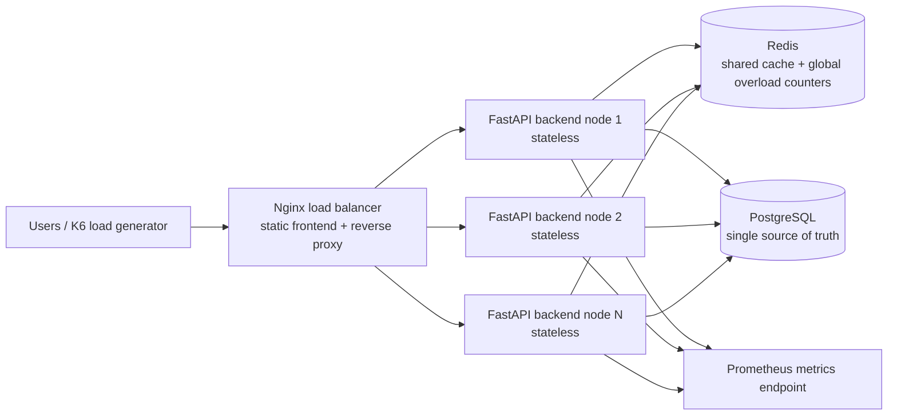

# Gamba Scalability Plan

This document defines the intended scope for the prototyping assignment. It is planning material for the repository documentation and should be adapted into your own presentation wording.

## Goal

Gamba is a sports event booking application used to evaluate backend scalability. The main hypothesis is:

> For a read-heavy sports event workload, scaling the stateless FastAPI backend from 1 to 3 to 5 nodes increases throughput until the shared PostgreSQL database or shared Redis cache becomes the bottleneck.

We intentionally scale the backend tier, not every component. PostgreSQL remains the source of truth, Redis remains a shared cache, and Nginx remains the public entry point.

## Proposed Architecture

Deployment variants:

- 1 backend node
- 3 backend nodes
- 5 backend nodes
- Optional bonus: repeat these with a larger VM type

## Component Responsibilities

| Component | Scaled? | Stateful? | Responsibility |
|---|---:|---:|---|
| Nginx | No | No | Public entry point, static frontend hosting, round-robin reverse proxy |
| FastAPI backend | Yes, 1/3/5 nodes | No | Auth, event API, cache lookup, overload checks, metrics |
| PostgreSQL | No | Yes | Persistent users, events, participations |
| Redis | No | Yes, ephemeral | Shared read-through cache and optional shared rate/load counters |
| K6 | No | No | Reproducible load generation |

## Requirement Mapping

| Requirement | Plan |
|---|---|
| Stateful/stateless separation | FastAPI nodes are stateless. Persistent state is only in PostgreSQL. Redis stores disposable cached state. |
| Horizontal scaling | Run the same backend code as 1, 3, and 5 backend VMs behind Nginx. |
| Vertical scaling | Optional bonus: repeat 1/3/5 backend-node tests on a larger VM type. |
| Performance metric | Measure throughput, p95 latency, error rate, cache hit rate, and HTTP 429 rate under K6 load. Primary metric: successful requests per second. |
| Overload mitigation | Use a hand-written limiter/load-shedder before expensive DB work. Prefer a shared Redis-backed token bucket or global concurrency counter so the limit protects PostgreSQL across all backend nodes. |
| Additional strategy 1 | Redis read-through cache for `GET /api/events`, with short TTL and invalidation on writes. |
| Additional strategy 2 | Query optimization: indexes on filter fields and a denormalized `joined_count` counter to avoid counting joins on every list request. |
| Observability | Expose Prometheus metrics and structured logs. Treat this as measurement support, not the main scalability strategy. |

## Redis Placement Decision

Redis should not be moved into each backend node if it is used as a shared cache.

Good options:

- Keep Redis on the infra/stateful VM next to PostgreSQL for this assignment.
- Put Redis on a separate stateful VM if you want cleaner separation.

Avoid:

- One Redis instance per backend node. That fragments the cache and makes invalidation inconsistent.
- Redis on only one backend VM. That makes one backend special and breaks the clean stateless backend story.

For this assignment, keeping PostgreSQL and Redis on the infra VM is acceptable. The limitation is clear: the stateful tier can become the bottleneck as backend nodes increase.

## Load Test Plan

Run the same K6 scenario against each deployment:

1. Warm up the system and seed users/events.
2. Run a read-heavy scenario against `GET /api/events`.
3. Run a mixed scenario with event reads and join attempts.
4. Record:
   - successful requests per second
   - p95 latency
   - error rate
   - 429 rate
   - cache hit/miss ratio
   - CPU/memory on backend and stateful VM, if available

Expected result:

- 1 to 3 backend nodes should improve throughput for API and CPU-bound work.
- 3 to 5 nodes may improve less if PostgreSQL, Redis, or Nginx becomes the bottleneck.
- Write-heavy joining will scale worse than read-heavy listing because all writes hit PostgreSQL.

## Known Limitations To Present

- PostgreSQL is a single node and will eventually limit write-heavy workloads.
- Redis is a single node and can become a bottleneck or single point of failure.
- If rate limiting is only in-memory per backend, the total accepted request rate grows with node count and does not fully protect PostgreSQL. A shared limiter is better for the final version.
- Exact-key cache invalidation can leave broader cached queries stale unless invalidation is expanded.
- Joining an event needs concurrency protection to avoid overbooking under high parallel load.

## Recommended Implementation Adjustments

Before final measurement, improve the current repository in these areas:

1. Replace or supplement the per-node in-memory token bucket with a shared Redis-backed limiter or global DB-work concurrency counter.
2. Expand cache invalidation so writes invalidate all affected list-query variants.
3. Add a transaction-safe join operation for capacity checks, for example row-level locking around the event row.
4. Add a mixed K6 scenario, not only read-heavy traffic.
5. Update the README to align with the final implementation and measured limitations.
